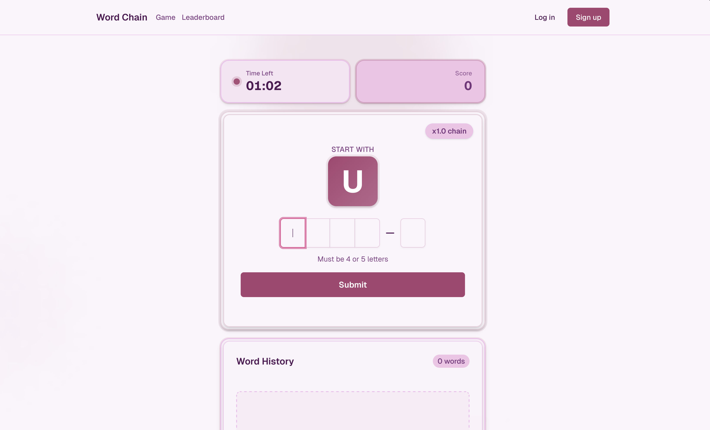

# 🎮WordChains 

A fast-paced daily word-building challenge where players race against time to create the longest chain of connected words and climb the global leaderboard.



##  How to Play

Start with the daily letter, type valid words that connect to each other, and watch your score multiply as you build longer chains. The longer your streak of valid words, the higher your multiplier—leading to exponentially growing scores!

##  Game Rules

- **Daily Challenge**: Get a new random starting letter each day at midnight IST
- **Time Limit**: 60 seconds to build your word chain
- **Word Length**: Minimum 4 letters; each word must be ±1 letter from the previous (but never below 4)
- **Chain Rule**: Next word must start with the last letter of your previous word
- **Dictionary**: Only valid English words accepted
- **No Repeats**: Can't use the same word twice in one game

##  Scoring System

Your score grows **exponentially** through the chain multiplier system:

- **Base Points**: Each word = letter count × 10 (e.g., "WORD" = 4 × 10 = 40 points)
- **Chain Multiplier**: Starts at 1.0x and increases by 0.5x with each consecutive valid word
- **Exponential Growth**: 1.0x → 1.5x → 2.0x → 2.5x → 3.0x and so on!

**Example**: 
- Word 1 (4 letters): (4 × 10) × 1.0x = **40 pts**
- Word 2 (5 letters): (5 × 10) × 1.5x = **75 pts**
- Word 3 (6 letters): (6 × 10) × 2.0x = **120 pts**
- Word 4 (5 letters): (5 × 10) × 2.5x = **125 pts**

⚠️ **Break the Chain**: Invalid words reset your multiplier back to 1.0x, but repeated words just give a warning.

## 🖼️ Screenshots

<!-- Add game screenshots here -->

## 🚀 Features

- **Daily Challenges**: New letter every day at midnight IST
- **Global Leaderboard**: Compete with players worldwide
- **Chain Multipliers**: Build massive scores with consecutive valid words
- **Real-time Validation**: Instant feedback on word validity
- **Responsive Design**: Play seamlessly on desktop and mobile
- **User Authentication**: Track your progress and rankings
- **Score History**: View your word chain and points breakdown

## 🛠️ Tech Stack

- **Framework**: Next.js 15 (App Router)
- **Language**: TypeScript
- **Styling**: Tailwind CSS + shadcn/ui
- **Database**: Supabase (PostgreSQL)
- **Authentication**: Supabase Auth
- **Dictionary API**: dictionaryapi.dev
- **Deployment**: Vercel

## 📦 Installation

```bash
# Clone the repository
git clone <repository-url>

# Install dependencies
npm install

# Set up environment variables
cp .env.example .env.local
# Add your Supabase credentials

# Run database migrations
# See docs/schema.sql for database setup

# Run the development server
npm run dev
```

Open [http://localhost:3000](http://localhost:3000) to start playing!

## 🔧 Environment Variables

```env
NEXT_PUBLIC_SUPABASE_URL=your_supabase_url
NEXT_PUBLIC_SUPABASE_PUBLISHABLE_KEY=your_publishable_key
SUPABASE_SERVICE_ROLE_KEY=your_service_role_key
```

## 🎮 Strategy Tips

1. **Plan Ahead**: Think about what letters will give you more options
2. **Use Longer Words**: More letters = more base points
3. **Protect Your Chain**: Verify words before submitting to avoid multiplier resets
4. **Speed Matters**: You have 60 seconds, but accuracy is more important than speed
5. **Know Common Endings**: Letters like E, S, R, T give you more word options

## 📝 License

This project is open source and available under the MIT License.

## 🤝 Contributing

Contributions, issues, and feature requests are welcome! Feel free to check the issues page or submit a pull request.

---

Built with ❤️ using Next.js and Supabase